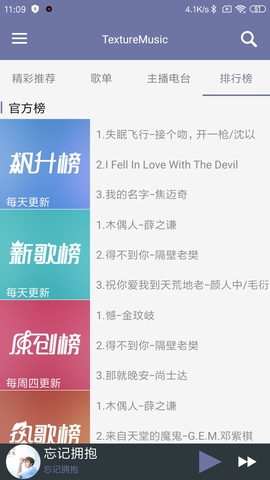
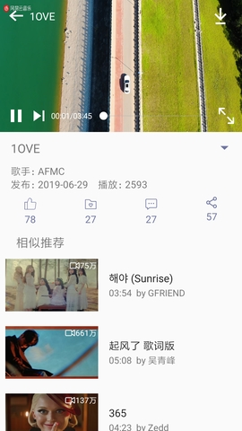
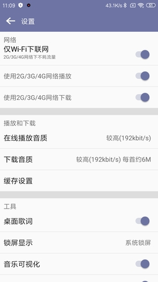

# TextureMusic

#### 项目介绍
本项目为一个音乐播放器，界面部分参考网易云音乐，项目中API主要来源为<a href="https://binaryify.github.io/NeteaseCloudMusicApi/#/">GitHub</a>上提供和
本人抓包获得，包含了网易云音乐的绝大部分API。
如有侵权请告知，我将删除GitHub上与之相关的一切代码。

#### 界面截图
  
  
  
  


#### 构建过程

1. 将该项目clone或者下载后在App的build.gradle同级目录下添加customConfig.gradle文件,文件内容如下：
```
ext.customConfig = [
        storePassword: '自己填写',
        keyAlias     : '自己填写',
        keyPassword  : '自己填写',
        shareSdkS    : 'shareSdkId(没有就填空)',
        shareSdkS1   : 'shareSdk秘钥(没有就填空)'
]
```
 如果不想使用上述方法来配置签名则直接将app级别的build.gradle中的第一行删除，然后自行配置签名

2. 编译项目并安装运行

#### 感谢以下开源项目
- <a href="https://github.com/square/okhttp"> OkHttp</a>
- <a href="https://github.com/ReactiveX/RxJava">RxJava</a>
- <a href="https://github.com/ReactiveX/RxAndroid"> RxAndroid</a>
- <a href="https://github.com/square/retrofit">Retrofit</a>
- <a href="https://github.com/trello/RxLifecycle"> Rxlifecycle</a>
- <a href="https://github.com/JakeWharton/RxBinding">Rxbinding </a>
- <a href="https://github.com/bumptech/glide">Glide</a>
- <a href="https://github.com/airbnb/lottie-android">Lottie</a>
- <a href="https://github.com/afollestad/material-dialogs">material-dialogs</a>
- <a href="https://github.com/hdodenhof/CircleImageView">CircleImageView</a>
- <a href="https://github.com/code-troopers/android-betterpickers">时间选择器</a>
- <a href="https://github.com/Commit451/NativeStackBlur">NativeStackBlur(高斯模糊)</a>
- <a href="https://github.com/alibaba/vlayout">Vlayout(RecyclerView动态布局)</a>
- <a href="https://github.com/google/ExoPlayer">Exoplayer(播放器)</a>
- <a href="https://github.com/danikula/AndroidVideoCache"> VideoCache(视频缓存)</a>
- <a href="https://github.com/cortinico/slidetoact">slidetoact(滑动解锁)</a>
- ..........................................

#### Liences
 Copyright 2014 - 2019 Henning Dodenhof

Licensed under the Apache License, Version 2.0 (the "License");
you may not use this file except in compliance with the License.
You may obtain a copy of the License at

    http://www.apache.org/licenses/LICENSE-2.0

Unless required by applicable law or agreed to in writing, software
distributed under the License is distributed on an "AS IS" BASIS,
WITHOUT WARRANTIES OR CONDITIONS OF ANY KIND, either express or implied.
See the License for the specific language governing permissions and
limitations under the License.


